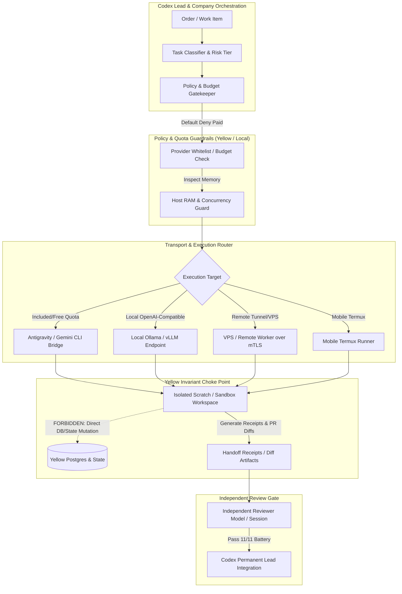

# Plan: DeepSeek-Based Company Model Harness (`dsh-company`)

## 1. Executive Summary & Strategy

Order741 establishes a private, high-token capability harness for company use, delegating extensive research, design, bounded coding, and multi-turn documentation tasks to Antigravity / Gemini CLI and low-cost/free worker models, while keeping OpenAI Codex as the permanent technical lead and company coordinator.

The primary objective is **task superiority on our private hospitality ERP codebase (Yellow) at minimal total cost and host footprint**, not competing for public leaderboard rankings or building a bloated standalone platform.

### Core Architectural Principles
1. **Reuse over Invention**: Base our solution on official upstream DeepSeek Harness (`@deepseek-ai/dsh` on Cordis), leveraging its existing "everything-is-a-plugin" architecture.
2. **Minimal Fork Slice**: Maintain an upstream-compatible fork/plugin layer rather than rewriting the framework.
3. **Strict Separation of Concerns**: Isolate policy enforcement, model execution, and transport layers. Model tools must never hold direct hospitality/finance/tenant runtime authority.
4. **Zero-Spend / Default-Deny Security**: All paid API execution is disabled by default. Strict budgets, explicit whitelists, and quota stops prevent unexpected financial expenditure or account ban risks.
5. **Host-Aware Efficiency**: Tailored for the measured host (Windows 11 Home, AMD Ryzen 5 5500U 6c/12t, ~15.35 GiB RAM, ~3.34 GiB free at inspection). Strict memory caps, lazy plugin loading, single default worker concurrency, and zero always-on fleet overhead.

---

## 2. Upstream Base Ground Truth & Verification

Verified against primary source repositories via GitHub API & raw source endpoints on 2026-09-26:

| Attribute | Verified Value | Source / Evidence |
|---|---|---|
| **Upstream Repo** | `deepseek-ai/deepseek-harness` | https://github.com/deepseek-ai/deepseek-harness |
| **Latest Commit SHA** | `477b4f420553e8a52c2fbccc464d7561b239c443` | `git/commits/477b4f42...` (Merged PR #5180, 2026-09-24) |
| **Latest Tag / Release** | `0.1.7-rc.2` | `package.json` v0.1.7-rc.2, Release PR #5180 |
| **License** | MIT License (Copyright 2026 DeepSeek) | `LICENSE` file on master branch |
| **Package Manager / Runtime** | `pnpm@11.7.0`, Node `^22.19.0 \|\| >=24.0.0` | `package.json` root engine specs |
| **Framework Engine** | Cordis (`@cordiverse/cordis`) | Spatiotemporal composability plugin framework |
| **Local Staged Copy** | `E:/yellow/dsh/0.1.5-rc.2` | Pre-installed offline reference |
| **Goose Benchmark / Tool** | `E:/yellow/goose/v1.51.0/dist-windows` | Offline tool execution reference |

### Primary Extension APIs in Upstream DSH
- **LLM Service (`ctx.llm`)**: Defined in `@deepseek-ai/dsh-llm`. Neutral provider registry providing `ctx.llm.stream(options)`, `listProviders()`, `listModels()`, and `resolveModel()`. Deep-freezes messages and yields token deltas ending in terminal `finish` chunk with standardized codes (`NO_ADAPTER`, `MISSING_CREDENTIAL`, `AUTH`, `RATE_LIMIT`, `QUOTA`, `CONTEXT_WINDOW_EXCEEDED`).
- **Dynamic Cordis Runner (`ctx.dynamicCordisRunner`)**: Defined in `@deepseek-ai/dsh-cordis-host-runner`. Evaluates host plugins in a `node:vm` sandbox with configurable timeouts (`vmTimeoutMs: 5000`).
- **Tool Discovery (`ctx.tools`)**: Exposed via `@deepseek-ai/dsh-tool-cordis` for runtime agent capability inspection.
- **Provider Adapters**: Separate modular packages (`dsh-llm-deepseek`, `dsh-llm-deepseek-api-key`, `dsh-llm-pi-ai`).

---

## 3. Four-Tier Architecture: Policy, Worker, Transport, Review

### 1. Policy Layer (`dsh-company-policy`)
- Default-deny all unbudgeted or paid network model calls.
- Enforces session budgets (token caps, request caps, wall-clock timeout).
- Prevents secret leakage: scans outbound tool contexts for credentials, API tokens, and private ERP connection strings.
- Strictly separates agent permissions: **no model has direct access to mutate Yellow database, run unapproved migrations, or bypass RLS**.

### 2. Worker Engine (`dsh-company-worker`)
- Built as standard Cordis plugins mounting onto `ctx.llm`.
- Providers include:
  - `antigravity-cli`: Wraps free/included-quota Gemini CLI / Antigravity workspace runner.
  - `local-compatible`: Connects to `127.0.0.1:11434` (Ollama) or local OpenAI-compatible endpoints when active.
  - `remote-worker`: For optional secure VPS / self-hosted endpoints.
- Lazy activation: providers remain dormant and consume zero memory until explicitly routed by policy.

### 3. Transport Layer (`dsh-company-transport`)
- Process-local IPC / subprocess wrappers for local tools.
- Strict mTLS / SSH transport for remote/VPS workers.
- Remote source sync uses minimal git diff / archive tarballs excluding `.env`, credentials, logs, and `node_modules`.

### 4. Independent Review Layer (`dsh-company-review`)
- As mandated by `AGENTS.md` and `PROJECT.md`, builder and reviewer must be independent sessions.
- Reviewer runs verification checks (lint, typecheck, contract tests, invariant battery) and writes a review receipt before Codex reviews for merge.

---

## 4. Hardware Sizing, Mobile & Efficiency Matrix

### Host Constraint Analysis
- **Hardware**: AMD Ryzen 5 5500U (6c/12t), 16 GiB physical RAM (~3.34 GiB free).
- **Hard Rule**: Host RAM is dynamic and transient. Large 70B+ local models cannot run directly on this host RAM without swapping or crashing the OS.
- **Worker Concurrency**: Default to **1 concurrent execution worker**. Bounded parallelism (max 2) permitted only when free memory exceeds 6 GiB.

### Capability & Cost Routing Matrix

| Provider / Tier | Cost Stance | Latency / Throughput | Best Suited Tasks | RAM / Host Impact | Status |
|---|---|---|---|---|---|
| **Antigravity / Gemini CLI** | Included / Free Quota | Fast (~50-100 tok/s) | High-token research, large file parsing, plan drafts, test generation | Very low (~100 MiB process) | **Works Now** |
| **Codex (OpenAI)** | Paid (Restricted) | High Reasoning | Permanent lead, architecture, order scoping, merge review | Zero local footprint | **Approved Lead** |
| **Local Small (3B–8B)** | Free (Local compute) | Medium (CPU: ~10-25 tok/s) | Fast offline linting, commit message generation, AST analysis | Medium (3–6 GiB RAM) | **Needs Verification** |
| **Mobile Termux (1B–3B)** | Free (Offloaded) | Low (5-10 tok/s) | Background diff verification, syntax checking | Zero laptop RAM | **Experimental** |
| **Self-Hosted VPS** | Paid Infra (Fixed) | High (GPU accelerated) | Heavy refactoring, long-horizon test sweeps | Zero laptop RAM | **Needs Setup** |

### Efficiency Optimizations (Cross-Harness Synthesis)
1. **Context Compaction & AST Snippets**: Avoid full-repo context dumping. Pass only targeted function definitions and interfaces.
2. **Deterministic Response Caching**: Cache idempotent read-only tool responses (e.g. `git status`, file reads against unchanged git shas).
3. **Lazy Plugin Activation**: Only load Cordis plugins required for the immediate task phase.
4. **Prompt & Schema Caching**: Leverage Gemini / Anthropic / DeepSeek prefix caching by keeping system instructions and tool definitions strictly constant.
5. **No Long-Running Fleets**: Tear down browser instances and terminal subshells immediately upon step completion.

---

## 5. Candidate Ecosystem Comparison & Status

| Candidate / Framework | License | Primary Architectural Feature Evaluated | Reuse Decision for Yellow |
|---|---|---|---|
| **DeepSeek Harness (`dsh`)** | MIT | Everything-is-a-plugin architecture on Cordis; neutral LLM streaming adapter. | **Selected Core Base** (clean modular plugin model). |
| **Block / Goose** | Apache 2.0 | Offline tool execution, extensible MCP integration, developer CLI. | **Inspect for MCP tool execution patterns**; reference local E drive install. |
| **OpenCode / Software Agent SDK** | Apache / MIT | Modular session handling and subagent loops. | Reference for finite-state subagent transitions. |
| **Browser-Use / UI-TARS** | MIT / Apache | DOM tree extraction before raw screenshot grounding. | Adopt DOM-first extraction rule for web inspection; do not run full vision loops locally. |
| **LangGraph / Hermes** | Proprietary/OSS | Durable graph checkpoints and episodic memory. | Adopt file-based JSON receipt logs (`handoff/receipts/`); reject heavy graph database runtimes. |
| **Omnigent / AMAP-ML / OSWorld** | Various / Academic | Multi-device orchestration, long-horizon benchmarks. | Evaluation evidence only; **UNKNOWN / UNPROVEN** for production ERP tasks. |

---

## 6. Implementation Slice 1: Specification & Gates

### Proposed Directory Layout (Minimal Slice)
Under `packages/company-harness/` (or standalone lightweight workspace):
- `packages/company-harness/src/policy/gatekeeper.ts`: Budget, token cap, and provider allowlist enforcement.
- `packages/company-harness/src/providers/gemini-cli-adapter.ts`: Provider adapter implementing upstream `dsh-llm` interface for Antigravity / Gemini CLI.
- `packages/company-harness/src/sandbox/workspace-isolation.ts`: Clean scratch directory isolation preventing state leakage.
- `packages/company-harness/tests/gatekeeper.test.ts`: Offline mock tests proving default-deny on paid endpoints and token cap enforcement.
- `packages/company-harness/tests/adapter.test.ts`: Unit tests validating token streaming and terminal chunk behavior.

### Verification Gates
1. **Mock Verification**: Run unit tests without network or credentials to prove policy defaults to deny.
2. **Tiny Included-Quota Smoke Test**: Execute a single bounded 10-token prompt through the Gemini CLI adapter verifying chunk reception and clean teardown.
3. **Yellow Invariant Battery**: Verify that running the harness produces zero unauthorized database modifications or schema drifts.
