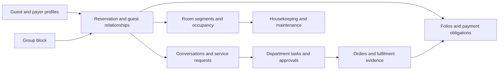

# Yellow: guest and staff journey, layered together

Research date: 2026-09-23. Order: [663](../handoff/orders/663-five-stage-guest-staff-journey-research.md).
Status: researched product blueprint; not implementation or live acceptance.

## 1. The organising principle

**Pre-arrival → Arrival → Stay → Departure → Post-departure** is the shared
service journey. At each stage, show what the guest needs, which staff member or
department owns the response, what information they share, and what proves completion.

These five chapters organise the experience; they do not replace reservation,
room, task, payment or folio states. A due-in guest has not necessarily arrived.
A pre-registration form does not establish physical occupancy. An occupied room
can be dirty. Departure does not automatically settle every account or resolve
every complaint. Cancellation and no-show are branches, not completed stays.

Booking, discovery and enquiry sit within pre-arrival for this five-stage map.
Returning guests begin a new journey linked to their existing profile.

The tables below are **Yellow design synthesis** from the founder's requirements,
existing Yellow contracts and the cited vendor documentation. They do not assert
that any one vendor delivers every row, or that Yellow already implements it.

## 2. Six layers at every stage

| Layer | What Yellow must answer |
|---|---|
| Guest | What can I do now? What have I bought or requested? What happens next? |
| Staff interaction | Who responds, what do they need to know, and which action completes the guest's intent? |
| Department work | Which cleaning, engineering, kitchen, transport or accounts work must happen behind the interaction? |
| Shared records | Which guest, reservation, room, order, task, bill and conversation does this concern? |
| Control and exceptions | What is pending, blocked, overdue, awaiting approval or dependent on another team? |
| Outcome | Was the promise fulfilled? How long did it take? Was billing correct? What remains open? |

The **booker, staying guest, sharer, company payer, travel agent and group organiser
can be different people or organisations**. Access and responsibility follow their
relationship, not merely the main name on the booking.

## 3. Stage-by-stage service blueprint

### Pre-arrival — prepare the promise and the delivery

Guest goal: know what is booked, what it costs, and what to expect.
Staff goal: remove preventable problems before arrival.

| Guest action / need | Staff owner and work | Shared record / completion |
|---|---|---|
| Compare rooms, packages and policies; enquire or book | Reservations/sales checks availability, applicable rate and cancellation terms; creates quote or confirms booking | Reservation, rate/policy version, source and guest profile; confirmation is delivered or delivery failure is visible |
| Change dates, cancel, ask for another room category | Reservations assesses inventory, price and policy impact; communicates outcome | Amendment/cancellation history; affected tasks and communications rescheduled or cancelled |
| Provide names, sharers, ETA and relevant preferences | Reservations/front desk resolves profile matches, missing information, accessibility needs and agreed requests | Guest-party links and arrival preparation; submitted information distinguished from verified information |
| Pay a deposit; say company pays room and guest pays extras | Cashier/accounts validates guarantee, deposit, credit agreement and charge routing | Payer, deposit/payment reference and billing instructions; no cash drawer required merely to record a non-cash workflow |
| Request transfer, cot, dinner, early arrival or celebration setup | Concierge assigns transport; housekeeping reserves items/prepares room; F&B schedules service | One request with linked fulfilment tasks, due time and owner; a request is not described as confirmed until accepted |
| Organiser submits group rooming list | Group sales/reservations checks block allotment, pickup, names, shares, arrival waves, cutoff and master billing | Block → individual reservations → guests; unresolved rows remain visible individually |

Suggested workspace: **Pre-arrival**, with filters for missing details, guarantee
issues, special requests and groups. Guest surface: **Plan my stay**.
Useful measures: preparation completion, outstanding deposits, unassigned
requests and approaching block cutoffs. Do not bury these behind total-booking charts.

Mews documents pre-stay extras/preferences and a browser guest portal across the
stay. Oracle documents rooming-list reservations consuming block allocation.
Those are useful precedents for this connected preparation flow. [S1][S4]

### Arrival — receive the person and make the room ready

Guest goal: reach the property, feel recognised and get access with minimal repetition.
Staff goal: complete a correct check-in while coordinating room readiness.

| Guest action / need | Staff owner and work | Shared record / completion |
|---|---|---|
| Arrive, identify booking, or request a walk-in | Reception locates the right booking; handles walk-in availability and profile matching | Actual arrival recorded separately from scheduled ETA and check-in |
| Confirm own and accompanying guests' details | Reception reviews submitted information, applicable registration requirements and changes | Explicit guest/sharer selection; only required missing information requested |
| Wait because the room is unavailable | Reception owns the promise; housekeeping prioritises cleaning and inspection; concierge handles luggage | Queue linked to room and task; guest sees an honest pending state and latest update |
| Accept room/upgrade and confirm payment arrangement | Reception checks room suitability and current availability; cashier handles payment/authorization where required | Assignment, commercial terms and financial prerequisites rechecked at commit |
| Receive key/access and welcome information | Reception/host completes check-in, confirms access delivery and explains entitlements | Successful stay transition and access outcome; failed lock integration remains an owned exception |
| Arrive separately from sharers or group | Reception checks in the selected people/rooms and tracks the remainder | Per-person/per-room arrival evidence; no bulk success inferred from one arrival |

Suggested workspace: **Arrivals**, with readiness reasons and a guided action
panel. Guest surface: **Check in / Your room status**.
Measure arrival-to-room time separately from staff processing time; count
waiting guests and blockers, not just successful check-ins.

Oracle's check-in documentation connects profiles, packages, identification,
payment, room assignment, registration and room queues. This supports a guided
workflow whose steps depend on property configuration. [S2]

### Stay — deliver services and resolve problems

Guest goal: enjoy the stay, receive what was promised and get help without repeating the story.
Staff goal: coordinate fulfilment, track commitments and keep charges accurate.

| Guest action / need | Staff owner and work | Shared record / completion |
|---|---|---|
| Request towels, cleaning or a preferred service time | Guest services triages; housekeeping accepts, schedules, completes and verifies where needed | Request ↔ task ↔ room/stay; DND and access restrictions respected |
| Order food, drink, spa, laundry, transport or an activity | Relevant outlet/concierge accepts order, checks entitlement/capacity, fulfils and posts applicable charges | Order items, fulfilment tasks and bill lines retain links; partial delivery is visible |
| Report a fault or complain | Guest services owns communication; engineering resolves fault; duty manager handles recovery decisions | Incident/request, work order, approval if needed, guest update and resolution record |
| Move room, add/change sharer or extend/shorten stay | Front desk coordinates availability, rate changes, keys, housekeeping and payer effects | Historical room segments and guest links preserved; accepted change reflected across affected teams |
| Ask what is included or view spending | Staff explains package entitlement and itemised folio; routes disputes to cashier | Consumed/remaining entitlements and charge references; duplicate postings prevented |
| Ask for an update or reject an incomplete resolution | Current owner responds; supervisor reassigns or escalates | Original request history retained; follow-up linked rather than silently replacing the record |

Suggested workspace: **In-house**, with a linked **Service desk** and department
queues. Guest surface: **My stay**, **My requests/orders**, **My bill**.
Measure first response, fulfilment time, overdue work, reopened issues and
unresolved complaints. Record timestamps before calculating these measures.

Oracle traces provide timed department instructions; room moves also involve
availability, housekeeping, shares and integrations. Yellow's shared service
layer extends those concepts into a guest-visible progress flow. [S3][S5]

### Departure — close the stay accurately and prepare the next arrival

Guest goal: understand/pay the correct bill and leave without friction.
Staff goal: coordinate settlement, physical departure and turnover.

| Guest action / need | Staff owner and work | Shared record / completion |
|---|---|---|
| Confirm departure time; ask for late checkout or transfer | Reception validates extension/late use; concierge schedules transport; housekeeping sees revised timing | Accepted departure time and tasks updated; next arrival impact visible |
| Review bill, query items or request split/company billing | Cashier confirms line-item allocation, payer and invoice details; authorised corrections retain history | Explicit folio windows, routed items and recipients; no overwriting issued financial evidence |
| Pay balance or use approved company credit | Cashier settles or performs the permitted AR transfer; handles failed payment | Confirmed payment/accounting result; provider timeout does not become assumed success |
| Check out self, one room, or selected sharers | Reception/guest flow previews affected people, room segments, bills and remaining occupants | Only permitted selected scope departs; retries cannot duplicate payment or room release |
| Return access, collect luggage, leave | Reception/host confirms departure; housekeeping receives turnover work; concierge finishes transfer | Occupancy released through canonical command; room readiness waits for cleaning/inspection |

Suggested workspace: **Departures**, opening the shared **Billing** panel in
context. Guest surface: **Review bill / Check out**.
Measures: ready-to-depart count, bill disputes, time to settle, late departures,
turnover backlog and rooms threatening the next arrival.

Cloudbeds documents a self-checkout limitation that can affect every room in a
reservation, including splits with different departure dates. Yellow should
explicitly display and validate the affected scope; copying a simple checkout
button without that detail would be unsafe for this requested product. [S7]

### Post-departure — finish obligations and sustain the relationship

Guest goal: retrieve documents, resolve any unfinished matter and return easily.
Staff goal: finish financial/service obligations and retain useful history.

| Guest action / need | Staff owner and work | Shared record / completion |
|---|---|---|
| Obtain receipt/invoice or report an error | Accounts resends the appropriate document or issues authorised correction | Document lineage and delivery outcome retained |
| Await deposit/authorization release or agreed refund | Accounts tracks the provider/accounting result and handles exceptions | Distinguish requested, provider-confirmed and reconciled outcomes |
| Report lost property or continue a complaint | Housekeeping records item custody; guest services owns return/resolution; manager approves recovery where needed | Open case persists after departure with owner, due time and updates |
| Give feedback or make another booking | Guest relations responds; CRM records permitted preferences/contact choices; reservations creates next stay | Feedback/service-recovery history linked to profile without exposing private staff notes |
| Company/agent settles outstanding account | Accounts follows receivables, commission reconciliation or disputes | Financial closure tracked independently of physical departure |

Suggested workspace: **Follow-up**, backed by service/CRM/accounts queues rather
than a second set of records. Guest surface: **Past stays / Documents / Open requests**.
Measures: unresolved post-stay cases, refund age, receivable age and repeat bookings.

Oracle permits configured post-stay charging/open folios. This demonstrates that
physical departure and financial closure can differ. Yellow's current documented
checkout guard still requires settlement or permitted AR transfer; an OPERA-style
open-folio departure would require an explicit future contract and review. [S6]

## 4. One service desk, several views of the same work

Keep the existing task lifecycle from [STATE-MACHINES.md](STATE-MACHINES.md):
`open → assigned → in_progress → done → verified` where verification applies,
with cancellation handled by the existing contract. Not every service needs an
inspection. A housekeeping task's completion and inspection remain distinct.

Do not invent database states merely to paint more coloured buttons. In this
blueprint, **overdue** derives from time, **awaiting approval** refers to an approval
record, **blocked** identifies a dependency and **escalated** identifies supervisory
attention. Their persistence/implementation must be specified before coding.

Each work item needs a subject/stay link, requester, responsible department,
current owner, priority, due time, permitted guest-facing message, internal notes,
dependencies, evidence and history. Changes to dates/room/guest must update the
work item's context without duplicating it.

| View | What the user sees |
|---|---|
| Guest | Request/order, accepted scope or price, progress, latest update and responsible team; an approved staff display name if the property enables it |
| Staff member | Assigned work, room/stay context, due time, dependencies and next action |
| Supervisor | Unassigned, overdue, blocked, pending inspection/approval, workload and handover |
| Reception | The guest's complete service story, with permission-limited billing/context |
| Manager/owner | Aggregated service/financial outcomes with authorised drill-down |

Guest and staff share the **record**, not every field. Sharers do not automatically
see each other's bills, contact details or requests. A company payer does not
automatically gain access to private guest conversations.

Cloudbeds documents reservation-triggered messages, tickets and internal alerts,
including room readiness conditions. Use the same principle: a committed event
creates or updates appropriate work; sending a message alone does not prove that
the work happened. [S8]

### Example: early arrival with a room change

1. Guest submits an early-arrival request and cot requirement before travel.
2. Reception accepts the request for coordination; housekeeping receives the cot
   task and a room-readiness task. No guaranteed access time is invented.
3. Guest arrives; the room is still being cleaned. Reception sees the blocker,
   guest sees a pending status, and concierge records luggage storage.
4. Supervisor verifies readiness; reception rechecks availability and completes
   check-in. The guest receives confirmed access information.
5. A later room fault creates an engineering task and guest-service case. If a
   move is approved, only the affected guests/segments move and related work follows.
6. Guest settles personal extras while the company-payer arrangement covers its
   agreed items. Checkout releases the appropriate room and creates turnover work.
7. A lost-item case stays open after checkout; its return closes the case separately.

This example crosses the five stages without requiring the guest to re-explain
each request to a different department.

## 5. Relationships and work that crosses stages

Conceptual relationships below are **not a new SQL schema**:

- One guest can have many stays; one stay can contain several guest relationships
  and room segments. A group block contains individual reservations whose stages
  can differ. Allocation, pickup and physical occupancy are separate measures.
- Food, drinks, dessert and other service categories organise catalogues/orders.
  Market segment group → market segment organises commercial attribution.
  Room type, room class, booking channel, source and corporate account remain
  independent dimensions, joined through the relevant reservation/stay facts.
- Aggregate room nights and revenue before calculating occupancy, ADR and RevPAR;
  do not average child percentages or multiply room nights by sharer count.
  Tax, room-revenue definitions, sellable inventory and currency scope must stay explicit.
- Shift handover spans all five stages: incoming staff inherit owners, promises,
  deadlines and unresolved items. Night audit, cashier handover, room discrepancies,
  interface failures and daily reconciliation are continuous operational work.
- Facilities maintenance, stock/procurement, rostering and owner accounting also
  exist without a guest request. Link them to a stay when relevant; do not invent
  a guest just to put them into a journey screen.

## 6. Configurable hotel/STR experience and practical screens

Setup supplies property type, offered services, departments, permissions,
arrival/access method, room-readiness requirements, payment arrangements and
escalation ownership. It determines the available actions within the same journey.
Existing statutory/accounting/occupancy rules remain authoritative.

For STR, reception work becomes host/remote-support work; add access instructions,
arrival support, turnover contractor assignment, inspections and owner reporting.
For a hotel, add staffed reception, concierge/outlets and department handovers.
Group hotels need block pickup/rooming-list drill-down; single-room properties need
the same underlying controls with fewer visible controls. These are Yellow design
requirements, not a claim about the scope of the sampled vendor articles.

Desktop: a restrained Today overview, five journey filters, room-plan/list views
and a shared detail panel containing guests, room, bill, requests and timeline.
Mobile staff: My work, arrivals/departures and urgent exceptions with large action
targets. Guest mobile: only the relevant stay, services, requests, bill and help.
Options reveal deeper controls. Colour always has a text/icon meaning. Glass
styling can frame overview cards; dense working tables must stay legible.

The market-data/RMS screen supports pricing, demand and distribution decisions
upstream of a booking. Channel acknowledgements and website booking failures need
owned queues. They share the commercial/inventory records but should not clutter
every guest's service screen. Marketplace listings do not require publishing
private guest data.

For the requested speed target, use bounded, paginated read models per workbench
and update affected records after a command. Measure cached interaction time,
server read latency and end-to-end device/network latency separately. **50 ms is
a target to benchmark, not a universal claim for payment, remote providers or all
network conditions.** Routine task routing and overdue detection need deterministic
rules; an LLM is optional assistance, not a dependency on every screen or action.

## 7. What the inspected Yellow checkout actually supplies

This is a bounded source inspection, not a branch-wide or deployed-app audit.

| Local evidence | Finding and consequence |
|---|---|
| [Founder capability ledger](../handoff/FOUNDER-JOURNEY-CAPABILITY-LEDGER.md) | Existing requirements and dated evidence; explicitly not a whole-product completion certificate. Retain traceability and reverify deployed claims. |
| [Operating journey](../src/demo/operating-journey.ts) | Cards cover arrival, stay, cashier, housekeeping, groups, checkout and Overwatch; action contract fixes `executionEnabled: false`. It is not a complete five-stage execution flow. |
| [App routes](../src/app.ts), [checkout command](../src/demo/governed-checkout-command.ts), [operator flow](../src/demo/operator-flow.ts) | Separate synthetic command/form paths exist. The sampled checkout command imports demo fixture identity. Source presence is not general hotel/tenant readiness or a verified current deployment. |
| `src/contexts/{crm,housekeeping,stay-operations,reservations,financials}/index.ts` | All five inspected files are zero bytes in this checkout. This does not prove absence in other branches; it does mean these public module surfaces cannot be cited as completed here. |
| [Groups context](../src/contexts/groups/index.ts) | Demo block/allotment/rooming-list workbench present. Selected actions are explicitly disabled; real end-to-end group handling needs separate acceptance. |
| [Baseline schema](../migrations/0001_init.sql), [lifecycles](STATE-MACHINES.md) | Party, guest links, reservation segments, tasks, folios and outbox offer foundational records/contracts. A table is not a working user journey. Baseline remains immutable. |

Reconcile existing implementations against this map before replacing them or
starting another application. Current evidence does not justify declaring all
five journeys complete or discarding usable work from other branches.

## 8. Acceptance journeys for subsequent implementation

1. Direct booking → pre-arrival details/deposit → ready-room arrival → actual stay
   service → correct bill/payment → checkout → delivered receipt and follow-up.
2. OTA modification after preparation reschedules affected tasks without duplicate
   bookings, charges or outdated arrival messages.
3. Early arrival to a dirty room remains queued until verified readiness; guest
   and staff see consistent progress.
4. Group pickup and rooming list respect allotment; staggered arrivals and departures
   leave unaffected rooms/guests unchanged.
5. Sharer/name edits, selected room move and extension preserve history, attribution,
   correct occupancy and the intended billing arrangement.
6. Guest order is partially fulfilled, adjusted and billed correctly; included
   package items are not charged twice.
7. Complaint crosses departments and shifts; the next owner sees the promise,
   escalation and resolution evidence.
8. Split/company billing and a failed payment produce an understandable recovery
   path; retry cannot double-charge or silently complete checkout.
9. Checkout triggers turnover; cleaning completion, inspection and future room
   availability remain distinct.
10. A refund, invoice correction or lost-item case is resolved after departure;
    unrelated guest/private/company data is not exposed.
11. STR access failure reaches remote support, and contractor turnover feeds the
    next arrival's readiness.
12. On a phone, connection loss shows a pending/failed action truthfully; a cached
    screen cannot manufacture a successful booking, payment or occupancy change.

Each acceptance must demonstrate the guest view, staff action, authorised durable
result, follow-up work and exception recovery. This research ran no application
acceptance tests and changes no runtime.

## Sources and limitations

Primary public documentation, checked 2026-09-23. This is a targeted comparison
of OPERA Cloud, Mews and Cloudbeds workflows, not exhaustive research of all PMSs
or a claim that every documented feature is included in a vendor's base package.
The system-design skill informed the separation of actors, records, dependencies
and outcomes; it did not introduce a technology change.

- [S1: Mews guest journey](https://community.mews.com/t/introduction-to-the-mews-guest-journey-convenient-contactless-services-for-digital-first-guests/3188): browser guest portal, pre-stay extras/preferences, in-stay messaging and checkout.
- [S2: OPERA checking in](https://docs.oracle.com/en/industries/hospitality/opera-cloud/25.1/ocsuh/t_checking_in_reservations.htm): configurable arrival steps and operational prerequisites.
- [S3: OPERA reservation traces](https://docs.oracle.com/en/industries/hospitality/opera-cloud/25.4/ocsuh/t_managing_reservations_adding_traces_to_reservations.htm): department work with date/time and completion.
- [S4: OPERA rooming lists](https://docs.oracle.com/en/industries/hospitality/opera-cloud/25.1/ocsuh/c_rooming_lists_group_rooming_lists_ch.htm): block pickup, linked reservations and shares.
- [S5: OPERA room move](https://docs.oracle.com/en/industries/hospitality/opera-cloud/25.3/ocsuh/t_arrivals_in-house_moving_an_in_house_reservation.htm): room/housekeeping/share/integration dependencies.
- [S6: OPERA post-stay charging and open folio](https://docs.oracle.com/en/industries/hospitality/opera-cloud/25.2/ocsuh/t_dep_check_out_res_with_open_folio.htm): configured separation of departure and financial closure.
- [S7: Cloudbeds guest portal](https://myfrontdesk.cloudbeds.com/hc/en-us/articles/7602101112091-Set-up-and-Manage-Cloudbeds-Guest-Experience-Guest-Portals): registration, billing/self-checkout, conversation continuity and documented multi-room limitations.
- [S8: Cloudbeds automated messages](https://myfrontdesk.cloudbeds.com/hc/en-us/articles/8699946508187-Cloudbeds-Guest-Experience-Automated-Messages-Everything-You-Need-to-Know): event/date triggers, internal tickets/alerts and room-ready prerequisites.
- [S9: Cloudbeds housekeeping](https://myfrontdesk.cloudbeds.com/hc/en-us/articles/25695101078427-Housekeeping-Everything-you-need-to-know): staff permissions, cleaning assignments and mobile/schedule surfaces. Department assignment is distinct from permission to operate the system.

Source markers in the stage tables point to this register. Uncited proposed
screens, metrics, STR adaptations and acceptance scenarios are Yellow synthesis.
