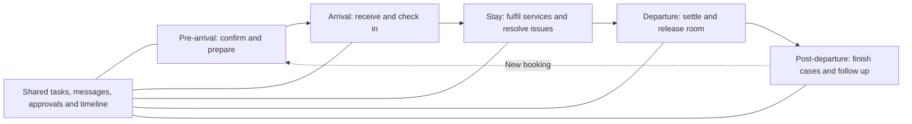

# PMS architecture and operating-flow comparison

Research date: 2026-09-23. [Order 664](../handoff/orders/664-pms-architecture-flow-comparison.md).
Companion: [Yellow guest/staff five-stage blueprint](GUEST-STAFF-JOURNEY.md).
Status: public-documentation research and Yellow design synthesis; no vendor
deployment audit, paid account access, performance benchmark or Yellow deployment.

## What the comparison establishes

The systems examined address substantially the same guest lifecycle:
**pre-arrival → arrival → stay → departure → post-departure**. Their differences
are the records they organise work around, how staff reach an action, how tasks
follow a reservation, and how billing and third-party services connect.

Ten systems cover enterprise hotels, independent hotels, mobile operations,
composable platforms and short-term rentals. This is not every PMS worldwide.
The workflow labels below are our interpretation of documented behaviour, not
vendor-certified architecture classifications. An omitted capability is unexamined,
not necessarily absent. Features can depend on edition, configuration or integration.

Three meanings of architecture must stay separate:

1. **Operating architecture:** screens, staff responsibilities and handoffs.
2. **Domain/integration architecture:** profiles, bookings, rooms, folios, tasks,
   APIs and events documented publicly.
3. **Runtime architecture:** deployment services, databases, caches and infrastructure.
   Public help pages generally do not establish this. An API does not prove a
   microservices backend; an all-in-one product does not prove a monolith.

## Comparison

| PMS | Documented workflow, summarised | Documented technical/domain structure | Pattern useful to Yellow — our assessment |
|---|---|---|---|
| **OPERA Cloud** | Reservation/profile or group block → arrival preparation and department traces → configurable check-in → in-house actions/room moves → billing windows and settlement → checkout and permitted financial follow-up | Separate profile, reservation, block, room and cashiering concepts; OHIP exposes APIs and business events. The sampled sources do not establish the internal deployment topology. | Detailed operator control, group pickup, routing, exception handling and explicit departmental responsibilities. Surface these in a coherent stay record. [O1][O2][O3][O4] |
| **Mews** | Booking/guest preparation → online or staffed check-in → accommodation and additional services → bill settlement/checkout → guest history and accounting reconciliation | A reservation is a service order. Accounting items attach to the guest account; stay-service items can be related to a reservation. Public APIs expose reservations, services and accounting. | Keep services and guest identity reusable across a stay; distinguish service consumption from billing and payment. [M1][M2][M3] |
| **Cloudbeds** | Reservation and guest portal → digital preparation → room readiness/check-in → messaging and service automation → folio/payment/self-checkout → triggered follow-up work | Vendor describes a shared guest/reservation/ledger model; HTTP APIs and webhooks expose operations, finance, distribution and guest data. Folios can belong to reservations or group profiles. | Integrated everyday work, event-triggered tasks and a browser guest experience; scope multi-room actions explicitly. [C1][C2][C3] |
| **apaleo** | Offers → booking containing one or more reservations → individual check-in/stay/check-out → reservation or booking-level folios/invoices; apps can supply additional guest workflows | Explicit booking/reservation separation; booker differs from guest. Core APIs cover booking, finance, payment and distribution, with webhooks and UI integration. Vendor describes its platform as MACH/API-first. | Clear boundaries and relationship modelling; an explicit booking container avoids treating the paying organiser as every room's occupant. [A1][A2][A3] |
| **Stayntouch** | Arrival/stay card → room assignment or queue → configured ready-room check-in → stay actions → guest bill/checkout and room-status handoff | Mobile operational surfaces; configurable room readiness and housekeeping task types; Connect APIs and event webhooks. Internal runtime topology was not established. | Put the next useful action beside the stay, and connect readiness directly to the arrival queue. [S1][S2] |
| **RMS Cloud** | Daily In/Out Movement workbench → reservation/account review → arrivals/in-house/departures → housekeeping coordination → accounts and end-of-day procedures | Reservation/area/account/task concepts; documented REST access provides a business-rule-processed view of RMS data. This is not direct proof of its internal database layout. | A shift-oriented control screen that brings guest movement, balances and room readiness together. [R1][R2] |
| **Guesty** | Calendar/inbox/reservation → guest details, scheduled messages and payments → access/stay operations → cleaning/maintenance tasks → folio and owner-accounting follow-up | Listings, reservations, guests, conversations and operational tasks; REST/JSON API with OAuth2. Owner statements belong to its Accounting offering. Internal service decomposition unverified. | Remote-property operations and one reservation accessible from calendar, inbox or tasks; retain separate guest and owner responsibilities. [G1][G2][G3][G4] |
| **Hostaway** | Listing/calendar reservation → communication and payment coordination → reservation-linked tasks → completion/turnover → owner reporting | REST/JSON API for listings/reservations and related objects; event webhooks. Tasks have an explicit acceptance/progress lifecycle and can follow changed reservation times. | Make assignment acceptance, due times and turnover work visible; clearly mark manual overrides to automatic schedules. [H1][H2][H3] |
| **eZee Absolute / Yanolja Cloud Solution** | Stay/tape chart or room view → reservation/walk-in/group → deposit and preparation → group/individual operations → charges, routing and departure; guest portal supports self-service | Web PMS with multiple operating views and linked group/individual billing features. Reviewed product pages do not disclose its backend deployment architecture. | Fast visual navigation across rooms/dates, straightforward group actions and progressive data entry. [E1][E2] |
| **Hotelogix** | Front desk reservation → guest details/room readiness/assignment → stay charges from connected outlets → folio/payment/invoice → checkout/housekeeping | Cloud PMS connects front desk, housekeeping, POS, distribution and reporting. Public workflow sources are not enough to classify internal runtime architecture. | A practical front-desk workspace that keeps room status and bill preparation within the same operating flow. [L1] |

## Meaningful differences, with concrete examples

### The central record differs

OPERA's documented operations are strongly organised around the reservation and
its related detail panels. Mews explicitly models a reservation as a service
order and separates account-level accounting from stay association. apaleo puts
individual reservations inside a booking carrying booker/payment information.
These are different data relationships, not merely different dashboard skins.
[O1][M2][A2]

Yellow should preserve distinct identities for guest, booker, company/agent,
group, room segment, service order, bill and payer, while showing the relevant
records together. One screen can combine them; one overloaded record cannot
faithfully represent every relationship. This is a design recommendation, not
a schema change approved by this research.

### Guest self-service does not remove staff work

The reviewed Mews and Cloudbeds guest surfaces let guests complete portions of
the journey themselves. Readiness, identity/payment exceptions and requests still
need a responsible operator. Stayntouch makes that dependency visible through
queued arrivals and configured readiness controls. [M1][C2][S1]

For Yellow, a guest submitting a form should create a clearly owned staff review
only when required. A successful payment should be confirmed from its actual
result. A room-ready notification should follow authoritative readiness rather
than merely a scheduled time.

### Timing and affected scope need explicit treatment

Cloudbeds' documented guest self-checkout can check out all rooms in a reservation,
including splits with different departure dates. Hostaway says manually changing
an auto-task's start/end time stops those times from following reservation changes.
Both are concrete reminders to show the scope and consequences of an action. [C2][H1]

Yellow should preview which guests, rooms, tasks and bills change, preserve manual
overrides visibly, and handle one group's staggered arrivals/departures separately.
An operator should not discover those consequences after clicking Complete.

### Financial and operational completion are separate

OPERA documents configured open-folio/post-stay charging. apaleo separates
reservation folios from a booking folio that can collect a booker's/company's
charges. Guesty documents owner statements summarising a different financial
relationship from a guest invoice. [O4][A3][G4]

Yellow needs three linked questions: **who occupied the room, who owes which
charges, and who receives which revenue?** STR owner accounting is not simply a
renamed guest folio. The current Yellow settlement/AR checkout guard remains in
force; alternate departure rules require their own domain design and review.

### Events coordinate work; they do not prove immediate completion

OHIP, Cloudbeds, apaleo and Stayntouch document event/API integration. Hostaway's
API warns that a conversation message event can arrive before its corresponding
reservation-created event. [O3][C1][A1][S2][H2]

Yellow's external adapters therefore need deduplication, retry and reconciliation.
The UI must distinguish requested, pending and confirmed external outcomes. A
database transaction and outbox can coordinate Yellow's internal modules without
turning every department into a separately hosted service.

## Recommended Yellow flow

This section is our synthesis, consistent with [PROJECT.md](../PROJECT.md).

The guest sees five chapters. Staff see the same chapters plus cross-stage queues
for **My work, unassigned, due soon, overdue, blocked and awaiting approval**.
Managers can drill into the work causing a delay or financial exception.

| Layer in Yellow | Responsibility |
|---|---|
| Guest portal / staff desktop / staff mobile | Appropriate views and actions on authorised shared records |
| Journey workbenches | Present stage, next action, blockers, associated bill and open requests |
| Existing domain modules | Enforce reservation, room, inventory, pricing, finance, service and access rules |
| PostgreSQL transactions + outbox | Persist authoritative outcomes and reliably record downstream work |
| Read models + background work | Keep screens bounded/fast; process notifications, distribution, reports and external adapters |

Retain the documented **TypeScript/Bun/Elysia/PostgreSQL 18 modular monolith** as
the baseline. API-first design and event-driven follow-up are compatible with a
monolith. They do not require copying another vendor's hosting architecture.
The comparison establishes no reason by itself to restart in Rust/C++.

For the founder's one-package scope, first-party PMS/CRM/service/billing screens
should share identities and permissions. CRS, booking website, channels, RMS and
market data use the same governed commercial/inventory records. External payment,
lock or OTA integration remains a separately observable adapter.

The useful combination is OPERA's operational depth, Mews' service/account
separation, Cloudbeds' joined-up guest flow, apaleo's explicit object boundaries,
Stayntouch's mobile readiness flow and the rental systems' distributed task/owner
work. This does not mean copying incompatible state machines or every setting.

The target is a complete demonstrated journey: guest action → staff work →
authorised persisted result → next team/guest update. Compare implementations
against the [acceptance scenarios](GUEST-STAFF-JOURNEY.md), including failures,
partial groups, sharers, room changes and split bills.

## Performance and evidence limits

No vendor was benchmarked. Marketing terms such as cloud-native, real-time,
all-in-one or API-first do not establish a 50 ms end-to-end user experience.
The architecture alone cannot establish that Yellow will be fastest either.

Set and measure separate budgets for immediate local UI response, server reads,
confirmed mutations and external provider operations. Keep routine hotel actions
independent of an LLM call. Improve measured slow paths before changing language
or deployment topology.

Research does not mark any Yellow module complete. Current source observations
and missing evidence are recorded in the companion journey map. This comparison
has not audited Protel/Planet, SIHOT, Maestro, Amadeus, little hotelier products or
every regional PMS, nor every module of the ten sampled systems.

## Primary-source register

Links were retrieved directly by root or the bounded research assistant on
2026-09-23. Runtime internals are marked unverified unless explicitly documented.

- [O1 — OPERA check-in](https://docs.oracle.com/en/industries/hospitality/opera-cloud/25.1/ocsuh/t_checking_in_reservations.htm)
- [O2 — OPERA rooming lists](https://docs.oracle.com/en/industries/hospitality/opera-cloud/25.1/ocsuh/c_rooming_lists_group_rooming_lists_ch.htm)
- [O3 — Oracle Hospitality Integration Platform](https://www.oracle.com/ca-en/hospitality/integration-platform/)
- [O4 — OPERA post-stay charging/open folio](https://docs.oracle.com/en/industries/hospitality/opera-cloud/25.2/ocsuh/t_dep_check_out_res_with_open_folio.htm)
- [M1 — Mews guest journey](https://community.mews.com/t/introduction-to-the-mews-guest-journey-convenient-contactless-services-for-digital-first-guests/3188)
- [M2 — Mews accounting integration model](https://docs.mews.com/connector-api/use-cases/accounting)
- [M3 — Mews reservation/service-order API](https://docs.mews.com/connector-api/operations/reservations)
- [C1 — Cloudbeds API/data model](https://www.cloudbeds.com/api/)
- [C2 — Cloudbeds guest portal](https://myfrontdesk.cloudbeds.com/hc/en-us/articles/7602101112091-Set-up-and-Manage-Cloudbeds-Guest-Experience-Guest-Portals)
- [C3 — Cloudbeds folio source types](https://developers.cloudbeds.com/reference/createfolio)
- [A1 — apaleo APIs](https://apaleo.com/open-apis)
- [A2 — apaleo bookings and reservations](https://apaleo.zendesk.com/hc/en-us/articles/360008645059-Introduction-to-Bookings-and-Reservations)
- [A3 — apaleo folio types](https://apaleo.zendesk.com/hc/en-us/articles/360017096760-Folio-Types-and-House-Account)
- [S1 — Stayntouch housekeeping/readiness configuration](https://stayntouch.freshdesk.com/support/solutions/articles/24000067861-housekeeping-configuration)
- [S2 — Stayntouch APIs and webhooks](https://www.stayntouch.com/developers/)
- [R1 — RMS daily hotel procedures](https://support.rmscloud.com/hc/en-gb/articles/13382616042767-Daily-Procedures-Guide-Hotel)
- [R2 — RMS REST API/data access](https://support.rmscloud.com/hc/en-gb/articles/12338050518543-Data-Warehouse-and-REST-API-access)
- [G1 — Guesty mobile reservation workbench](https://help.guesty.com/hc/en-gb/articles/9365054611613-Managing-reservations-in-the-Guesty-mobile-app)
- [G2 — Guesty tasks](https://help.guesty.com/hc/en-gb/articles/9370553270941-Managing-tasks)
- [G3 — Guesty Open API](https://open-api-docs.guesty.com/reference/get-started)
- [G4 — Guesty owner statements](https://help.guesty.com/hc/en-gb/articles/9369443472285-Getting-started-with-owner-statements)
- [H1 — Hostaway task lifecycle](https://support.hostaway.com/hc/en-us/articles/360036506093-Tasks-Create-Manage-Assign-Tasks)
- [H2 — Hostaway Public API](https://api.hostaway.com/documentation)
- [H3 — Hostaway owner statements](https://support.hostaway.com/hc/en-us/articles/36003559089947-Owner-Statements-Overview)
- [E1 — eZee reservation centre](https://www.ezeeabsolute.com/features/reservation-center.php)
- [E2 — eZee guest portal](https://www.ezeeabsolute.com/features/guest-self-service-portal.php)
- [L1 — Hotelogix front-desk workflow](https://www.hotelogix.com/blog/hotelogix-frontdesk)

The eZee pages identify their current destination as Hotel PMS by Yanolja Cloud
Solution. Oracle reference versions and vendor help revisions can differ; confirm
applicable configuration/API contracts before implementation or integration.
